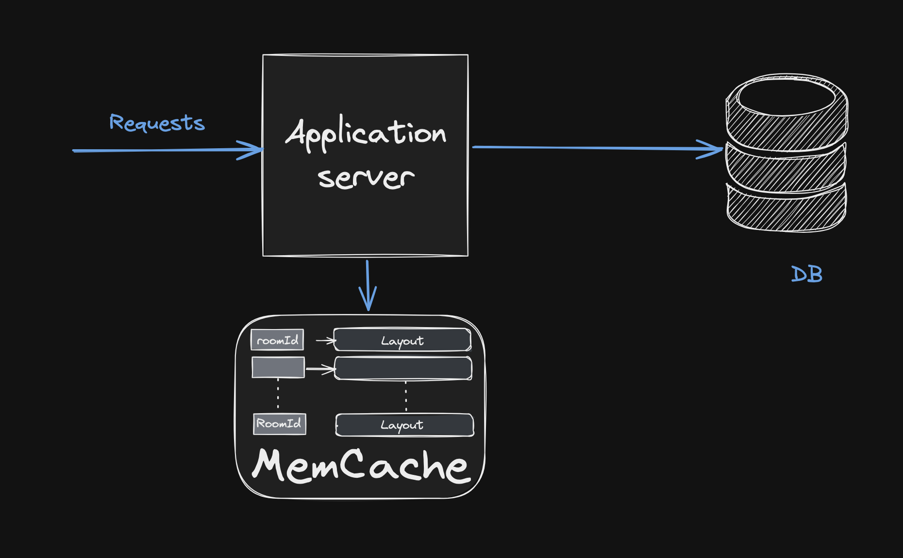

# Cinema at Manhattan

## Initial Assumptions:
- Since the prompt does not define what a group is, I assume that seats reserved by the same user will belong to the same group.
- The system has 2 roles for the APIs:
  - Admin: has permission to create rooms and view the list of all rooms.
  - User: can view the list of available seats by roomId, reserve seats, and cancel reservations.


## System Requirements:
- Java 17 or higher
- Maven 3.8.1 or higher
- Docker version 27.2.0 or higher
- Docker Compose version 2.17.2 or higher
## Application Installation
### 1. Clone the repository:
```
    https://github.com/CaoTien22/cinema-at-manhattan
    cd cinema-at-manhattan
```

### 2. Initialize the Database::
- Run the following command to initialize the MySQL container:
```angular2html
docker-compose -f compose-only-db.yaml up -d
```
*Note: Using the **root** schema for simplicity in setup.*
### 3. Run the application:
- Build the application:
```angular2html
mvn clean install
```
- Run the application:
```angular2html
mvn spring-boot:run
```
- If you prefer not to use Java, you can also start the application using Docker Compose:
  - Stop the running database container:  
```angular2html
docker-compose -f compose-only-db.yaml down
```
  - Run the app and the database together:
```angular2html
docker-compose -f compose-app-db.yaml up -d

```
### 4. Using the APIs:
- You can use Postman and import the API collection from the ***api_collection.json*** file for testing.
- Alternatively, access Swagger at: 
```angular2html
http://localhost:8080/swagger-ui/index.html
```
- To use the APIs, you need to log in first: 
  - Admin account: admin / admin (used for Create Room and Get All Rooms APIs)
  - User accounts: user_1, user_2, user_3 with corresponding passwords user_1, user_2, user_3 (used for Get Available Seat, Reserve Seat, and Cancel Seat APIs).
##Application Architecture:


### 1.  Database:
  - Tables role, user, user_roles: store user and admin information.
  - Table cinema_room: stores the configuration of the room (length, width, minimum distance between seats).
  - Table reserved_seat: stores the coordinates of reserved seats, the userId who reserved them, and the roomId to identify which room they belong to.
### 2. MemCache:
  - After loading room information and reserved seats from the database, the system will calculate the layout for that room.
  - After loading room information and reserved seats from the database, the system will calculate the layout for that room. The layout is a two-dimensional array, where the value 0 represents a vacant seat, and other values represent the userId of the person who reserved that seat.
  - The layout will be cached to reduce the load on the database and minimize the number of calculations.
  - The system will lock the layout by roomId to prevent concurrency issues when multiple users are reserving seats in the same room.
### 3. Limitations:
  - Due to time constraints, the current solutions are not optimized.
  - The use of local cache will not remain accurate when the application is deployed across multiple instances.
  - Implementing Optimistic Lock and Pessimistic Lock at the database level will be better than locking in the code.
