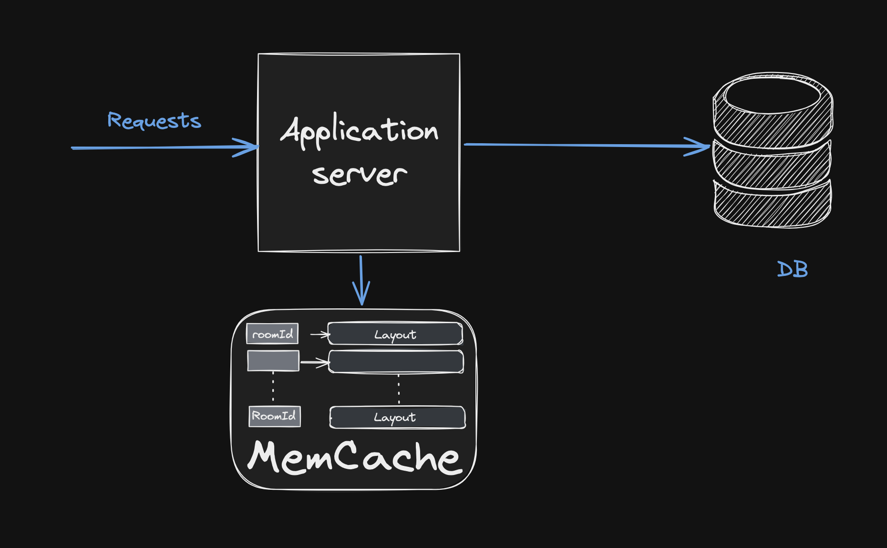

# Vulcan Labs Test(Latest update, I'm fail)
 If you're candidate and trying to join Vulcan company, follow my exp.
- [Question](VulcanLabs%20Assignment.pdf).

If you use my code, you will definitely fail. Because I failed, so just use it for reference.

I got the following feedback:
```angular2html
No locking mechanism is observed when booking or canceling seats. 
What would happen if multiple requests attempted actions on the same seat simultaneously?
Checking seat availability or reserving requires scanning all seats in a room, 
reducing performance -> Should find a better solution to detect this seat is available or not -> O(1)
instead of O(n)
```

- First, constraints like concurrency or O(1) complexity,... are not in the question at all.
- Second, I checked the lock on each roomId on java, so it is confusing to say that I did not guarantee concurrency (maybe for them, locking on the Database with Pessimistic lock is the truth - if so, maybe you should consider joining this company).
- Third, O(n) is not necessarily slower than O(1). Caching and minimizing the number of DB accesses may be more efficient than trying to solve the problem at O(1). (That is what I did and it seems they did not read my code, or they are just noob).
- Finally, if you feel like you're going to spend too much time on this test, skip them, study, and find a better company (don't be like me).

## Initial Assumptions:
- Since the prompt does not define what a group is, I assume that seats reserved by the same user will belong to the same group.
- The system has 2 roles for the APIs:
  - Admin: has permission to create rooms and view the list of all rooms.
  - User: can view the list of available seats by roomId, reserve seats, and cancel reservations.


## System Requirements:
- Java 17 or higher
- Maven 3.8.1 or higher
- Docker version 27.2.0 or higher
- Docker Compose version 2.17.2 or higher
## Application Installation
### 1. Clone the repository:
```
    https://github.com/CaoTien22/cinema-at-manhattan
    cd cinema-at-manhattan
```

### 2. Initialize the Database::
- Run the following command to initialize the MySQL container:
```angular2html
docker-compose -f compose-only-db.yaml up -d
```
*Note: Using the **root** schema for simplicity in setup.*
### 3. Run the application:
- Build the application:
```angular2html
mvn clean install
```
- Run the application:
```angular2html
mvn spring-boot:run
```
- If you prefer not to use Java, you can also start the application using Docker Compose:
  - Stop the running database container:  
```angular2html
docker-compose -f compose-only-db.yaml down
```
  - Run the app and the database together:
```angular2html
docker-compose -f compose-app-db.yaml up -d

```
### 4. Using the APIs:
- You can use Postman and import the API collection from the [**api_collection.json**](api_collection.json) file for testing.
- Alternatively, access Swagger at: 
```angular2html
http://localhost:8080/swagger-ui/index.html
```
- To use the APIs, you need to log in first: 
  - Admin account: admin / admin (used for Create Room and Get All Rooms APIs)
  - User accounts: user_1, user_2, user_3 with corresponding passwords user_1, user_2, user_3 (used for Get Available Seat, Reserve Seat, and Cancel Seat APIs).
## Application Architecture:


### 1.  Database:
  - Tables role, user, user_roles: store user and admin information.
  - Table cinema_room: stores the configuration of the room (length, width, minimum distance between seats).
  - Table reserved_seat: stores the coordinates of reserved seats, the userId who reserved them, and the roomId to identify which room they belong to.
### 2. MemCache:
  - After loading room information and reserved seats from the database, the system will calculate the layout for that room.
  - The layout is a two-dimensional array, where the value 0 represents a vacant seat, and other values represent the userId of the person who reserved that seat.
  - The layout will be cached to reduce the load on the database and minimize the number of calculations.
  - The system will lock the layout by roomId to prevent concurrency issues when multiple users are reserving seats in the same room.
### 3. Limitations:
 *Due to time constraints, the current solutions are not optimized.*
  - The use of local cache will not remain accurate when the application is deployed across multiple instances.
  - Implementing Optimistic Lock and Pessimistic Lock at the database level will be better than locking in the code.
